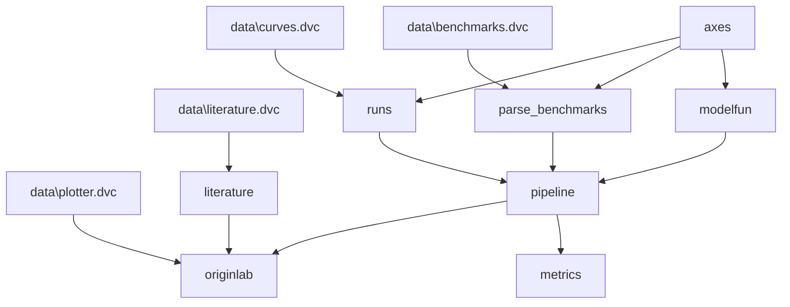

# boilerdata

 

Data processing pipeline for a nucleate pool boiling apparatus.

## Overview

The data processing approach taken in this repository started over at [pdpipewrench](https://github.com/blakeNaccarato/pdpipewrench). It was initially conceptualized as a way to outfit [pdpipe](https://github.com/pdpipe/pdpipe) pipelines from configuration files, allowing for Pandas pipeline orchestration with minimal code. I have since adopted a less aggressive tact, where I still separate configuration out into YAML files (constants, file paths, pipeline function arguments, etc.), but pipeline logic is handled in `pipeline.py`. I have also done away with using `pdpipe` in this approach, as it doesn't lend itself particularly well to [ETL](https://en.wikipedia.org/wiki/Extract,_transform,_load). Besides, my data processing need is not quite the "flavor" of statistical data science type approaches supported by `pdpipe`.

This new approach maintains the benefits of writing logic in Python, while allowing configuration in files. I am using [Pydantic](https://github.com/samuelcolvin/pydantic) as the interface between my configs and my logic, which allows me to specify allowable values with `Enums` and other typing constructs. Expressing allowable configurations with Pydantic allows for generation of schema for your config files, raising errors on typos or missing keys, for example. I also specify the "shape" of my input and output data in configs, and validate my dataframes with [pandera](https://github.com/pandera-dev/pandera). Once these components are in place, it is easy to implement new functionality in the pipeline.

## Usage

If you would like to adopt this approach to processing your own data, you may clone this repository and begin swapping configs and logic for your own, or use a similar architecture for your data processing. To run a working example with some actual data from this study, perform the following steps:

1. Clone this repository and open it in your terminal or IDE (e.g. `git clone https://github.com/blakeNaccarato/boilerdata.git boilerdata`).
2. Navigate to the clone directory in a terminal window (e.g. `cd boilerdata`).
3. Create a Python 3.10 virtual environment (e.g. `py -3.10 -m venv .venv` on Windows w/ Python 3.10 installed from [python.org](https://www.python.org/)).
4. Activate the virtual environment (e.g. `.venv/scripts/activate` on Windows).
5. Run `pip install --editable .` to install `boilerdata` package in an editable fashion. This step may take awhile.
6. Delete the top-level `data` and `config` directories, then copy the `config` and `data` folders inside of `tests/data` to the root directory.
7. Copy the `.propshop` folder in `tests/data/.propshop` to your user-folder (e.g. `C:/Users/<you>/.propshop` on Windows).
8. Run `dvc repro metrics` to execute the data process up to that stage.

The data process should run the following stages: `axes`, `modelfun`, `runs`, `parse_benchmarsk`, `pipeline`, and `metrics`. Some stages are skipped because we specified to run just the necessary stages up to `metrics` (the example data doesn't currently include the literature data). You may inspect the pipeline stages of the same name in `src/boilerdata/stages`, such as `pipeline.py` to see the logic that runs during that stage. This example happens to use Python scripts, but you could define a stage in `dvc.yaml` that instead runs Matlab scripts, or any arbitrary action. This approach allows for the data process to be reliably reproduced over time, and for the process to be easily modified and extended in a collabroative effort.

There are other details of this process, such as the hosting of data in the `data` folder in a Google Cloud Bucket (alternatively it can be hosted on Google Drive), and more. This has to do with the need to store data (especially large datasets) outside of the repository, and access it in an authenticated fashion.

## Data process graph

This data process graph is derived from the structure of the code itself. It is automatically generated by [dvc](https://dvc.org/). This self-documenting process improves reproducibility and reduces documentation overhead.

## Project information

- [Changes](<https://softboiler.github.io/boilerdata/changelog.html>)
- [Docs](<https://softboiler.github.io/boilerdata>)
- [Contributing](<https://softboiler.github.io/boilerdata/contributing.html>)

## Contributors

<!-- ALL-CONTRIBUTORS-LIST:START - Do not remove or modify this section -->
<!-- ALL-CONTRIBUTORS-LIST:END -->
